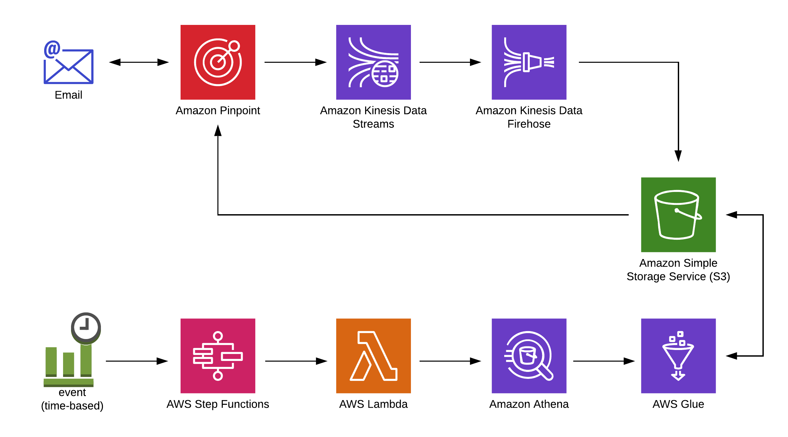

# Amazon Pinpoint Re-Engagement Campaigns using Amazon Athena

Re-Engage your users, increase your email sending reputation with Internet Service Providers (ISPs) and webmail providers, attain better visibility into campaign metrics, and decrease your email sending costs with a well running re-engagement marketing campaign targeting users who are no longer engaged with your emails.

## Use Case: What is a Re-Engagement Campaign

Put simply, a re-engagement campaign is an email marketing campaign that targets users who have not opened or clicked (engaged) with email messages in a certain period of time to entice them to re-engage with the brand or remove them from your future email sends.  Marketers have many strategies on what to communicate in a re-engagement campaign from "Are you still interested in our communications?" to "Are you breaking up with us?".  No matter the strategy, re-engagement campaigns can have many positive benefits to both your users and your ability to deliver messages to users who do want it.

## Architecture


## Repository content
Main files:
```bash
.
├── README.MD                                           <-- This instructions file
├── cloudformation                                      <-- Folder for the AWS CloudFormation Templates
│   └── solution.template.yaml                          <-- Template to configure the solution
├── lambdas                                             <-- Folder for the AWS Lambda Function code
│   └── QueryStartUnEngagedLambda.js                    <-- Kick-off the Unengaged query
│   └── QueryStatusUnEngagedLambda.js                   <-- Check the status of the Unengaged query
│   └── QueryImportSegmentUnEngagedLambda.js            <-- Start the Segment Import
│   └── ImportStatusUnegagedLambda.js                   <-- Check for the status of the Segment Import
│   └── ImportSuccessTagLambda.js                       <-- Apply a tag to the Pinpoint Segment
│   └── FirehoseRecordConversionLambda.js               <-- Add line breaks in the Pinpoint event stream
├── sql                                                 <-- Folder for the Athena SQL queries
│   └── find_unegaged_users.sql                         <-- Query to find Unengaged users
```

## Why are Re-Engagement Campaigns Important

### 1.  Improved Email Deliverability across ISPs

ISPs do pay attention to who engages with your emails.  Your reputation as an email sender is based partially on how your users engage with your email.  ISPs take note when users do not open or click your emails which can have consequences on future email sending reputation calculations.  

### 2.  Opportunity to Recapture User Interest

Some users just needed to know that you were paying attention to them and were waiting for a queue to become re-engaged.  

### 3.  Improve Overall Engagement Metrics

If you have a significant amount of non-engaged users, no matter the messaging, it clouds your campaign engagement metrics and A/B testing efforts.

### 4.  Keep Email Lists Clean and Up-to-Date

If users fail to be re-engaged, then suppressing them from future email lists allows you to keep your email lists filled with engaged users.


## Solution
This Solution provides a complete solution to setup and automate a re-engagement campaign using Amazon Pinpoint.  It will:
* Optionally: Create a new Amazon Pinpoint Project to use for your outgoing campaigns
* Create a new Amazon Pinpoint Project called "My Re-Engagement" Project
* Create a segment named "Unengaged Users" in the "My Re-Engagement" Project
* Configure a Kinesis Stream and Kinesis Firehose to route Pinpoint engagement events (Sends, Opens, Clicks, etc) to Amazon S3
* Set up a Daily process using Amazon CloudWatch Events, Amazon Step Functions, AWS Lambda, Amazon Athena to query the engagement data in Amazon S3 and update the "Unegaged Users" Segment
* The Query determines un-engaged by:
  * Looks at users who have received at least 5 emails in the last 10 months
  * Selects only the users who have not Opened or Clicked an email in the last 6 months

All that is left is for you to setup a Campaign in Amazon Pinpoint to run daily that will use the "Unegaged Users" segment and design the email messaging appropriately.

### Step Function State Machine

The Solution uses a State Machine in Amazon Step Functions to perform the daily queries and segment imports.  It uses a series of Lambda functions to perform asynchronous actions avoiding paying for Lambda execution time to wait for processing of queries or imports.  The State Machine is kicked off daily by a CloudWatch Event scheduled to run daily.


### Athena Query
```
WITH dataset AS (
  SELECT
    facets.email_channel.mail_event.mail.destination as emailaddresses,
    event_type,
    arrival_timestamp
  FROM "pinpoint-events"."[REENGAGEMENT_S3_TABLENAME]"
  WHERE
    (event_type = '_email.delivered' AND from_unixtime(arrival_timestamp/1000) > date_add('month', -10, current_date))
   OR
    (event_type IN ('_email.open', '_email.click') AND from_unixtime(arrival_timestamp/1000) > date_add('month', -6, current_date))
),
delivered AS (
  SELECT
    emailaddresses,
    'DELIVERED' AS event_type,
    arrival_timestamp
  FROM dataset
  WHERE event_type = '_email.delivered'
),
engaged AS (
  SELECT
    emailaddresses,
    'ENGAGEMENT' AS event_type,
    arrival_timestamp
  FROM dataset
  WHERE event_type IN ('_email.open', '_email.click')

),
joined AS (
  SELECT
    emailaddresses,
    arrival_timestamp AS delivered_timestamp,
    null AS engagement_timestamp
  FROM delivered
  UNION
  SELECT
    emailaddresses,
    null AS delivered_timestamp,
    arrival_timestamp AS engagement_timestamp
  FROM engaged
),
flatten AS (
  SELECT emailaddress, delivered_timestamp, engagement_timestamp
  FROM joined
  CROSS JOIN UNNEST(emailaddresses) as t(emailaddress)
),
min_max AS (
  SELECT
    emailaddress,
    MAX(delivered_timestamp) AS max_delivered_timestamp,
    MIN(delivered_timestamp) AS min_delivered_timestamp,
    MAX(engagement_timestamp) AS last_engagement,
    COUNT(delivered_timestamp) AS num_delivered
  FROM flatten
  GROUP BY emailaddress
)
SELECT
  'EMAIL' AS ChannelType,
  emailaddress AS Id,
  emailaddress AS Address,
  max_delivered_timestamp AS "Attributes.max_delivered_timestamp",
  min_delivered_timestamp AS "Attributes.min_delivered_timestamp",
  last_engagement AS "Attributes.last_engagement",
  num_delivered AS "Attributes.num_delivered"
FROM min_max
WHERE last_engagement IS NULL -- No Engagement in the last 6 months
  AND from_unixtime(min_delivered_timestamp/1000) < date_add('month', -6, current_date) -- Emails started more than 6 months ago
  AND num_delivered > 5 -- Has at least 5 delivered emails
```

Query Details
* The final SELECT creates a CSV format that can be imported directly into Amazon Pinpoint.  It therefore creates three Amazon Pinpoint Endpoint attributes for:
 * max_delivered_timestamp - the latest delivered message in a 10 month window
 * min_delivered_timestamp - the first delivered message in a 10 month window
 * last_engagement - Last time the user engaged with an email
 * num_delivered - Number of emails delivered in the last 10 months

  These attributes can be used to further refine the "Unengaged Users" Segment.
* Query can be easily tuned to match your specific re-engagement requirements.

## Prerequisites

You need the following:

* An AWS account with sufficient permissions to create the resources shown in the diagram in the earlier section. For more information about creating an AWS account, see [How do I create and activate a new Amazon Web Services account?](https://aws.amazon.com/premiumsupport/knowledge-center/create-and-activate-aws-account/).
* The AWS Command Line Interface (AWS CLI) installed and configured on your macOS-based computer. For information about installing the AWS CLI, see [Installing the AWS Command Line Interface](https://docs.aws.amazon.com/cli/latest/userguide/installing.html). For information about setting up the AWS CLI, see [Configuring the AWS CLI](https://docs.aws.amazon.com/cli/latest/userguide/cli-chap-getting-started.html).

## Setup


## TODO Section
Potential Configuration Inputs:
- Kinesis Stream ARN if already configured in Pinpoint
- Kinesis Firehose ARN if already configured in Pinpoint
- Window to look back for engagement (default 6 months)
- Window to look back for emails (default 10 months)
